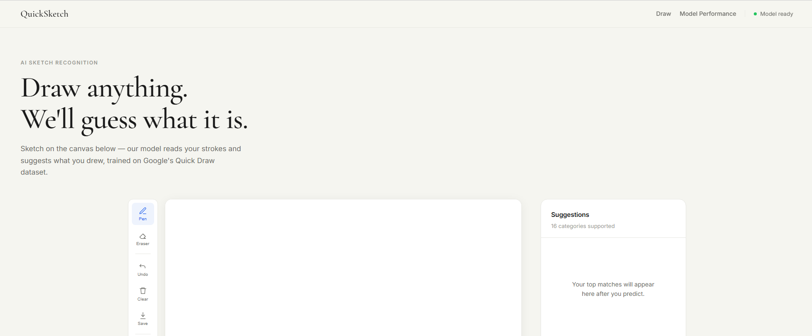
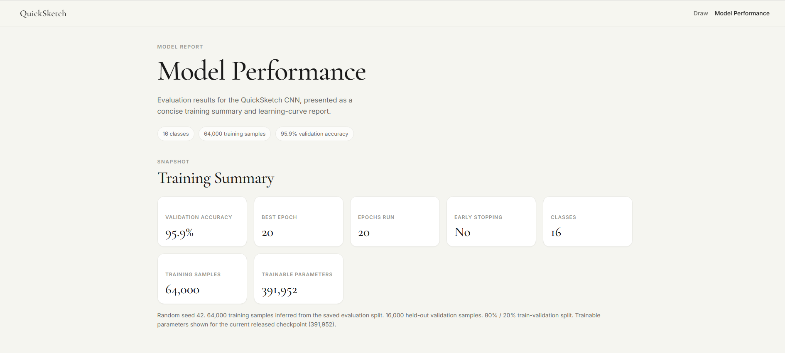
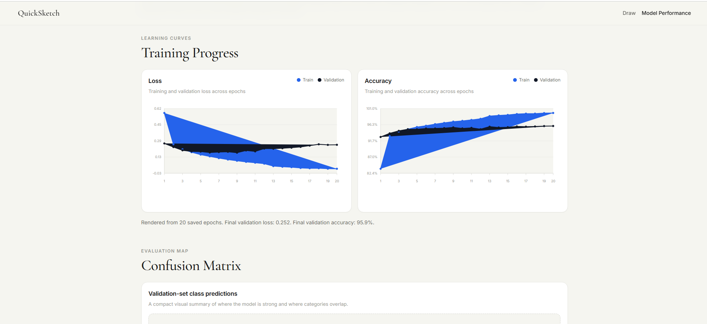
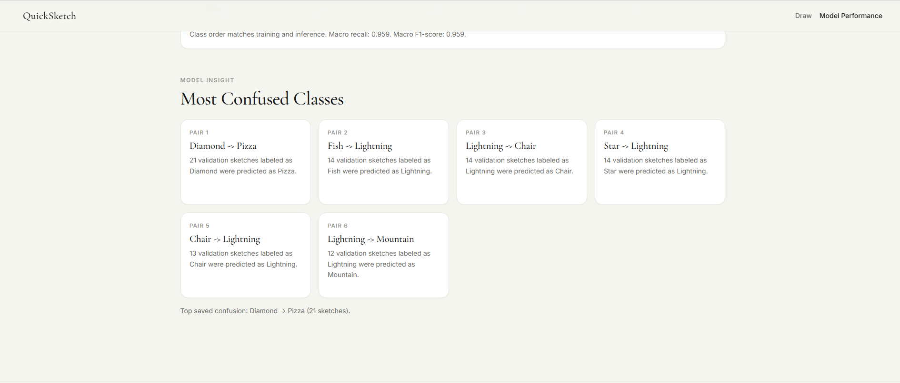

<div align="center">

# ✏️ QuickSketch

**AI-powered sketch recognition — draw anything, we'll guess what it is.**

[](https://python.org)
[](https://pytorch.org)
[](https://flask.palletsprojects.com)
[](#model-details)
[](#model-details)
[](LICENSE)

<br/>

QuickSketch is a full-stack AI web application that recognises hand-drawn sketches in real time.
Draw on the canvas, hit **Predict**, and a custom-trained PyTorch CNN classifies your sketch
against 16 categories — returning ranked predictions with confidence scores, all in under a second.

**[🚀 Live Demo]([#](https://madhavzanwar.github.io/quicksketch/))** &nbsp;·&nbsp; **[📊 Model Performance]([#model-performance](https://madhavzanwar.github.io/quicksketch/performance.html))** 

<br/>

---

</div>

## 📸 Screenshots

<table> <tr> <td align="center" width="50%">  <br> <sub><b>Homepage</b> — Draw sketches in real time and receive AI-powered predictions instantly.</sub> </td> <td align="center" width="50%">  <br> <sub><b>Model Performance</b> — Validation accuracy, training summary, model statistics, and evaluation metrics.</sub> </td> </tr>

<tr> <td align="center" width="50%">  <br> <sub><b>Training Curves</b> — Training vs validation accuracy and loss across 20 epochs.</sub> </td> <td align="center" width="50%">  <br> <sub><b>Confused Categories</b> — Confusion matrix insights highlighting commonly misclassified classes.</sub> </td> </tr> </table>

---

## ✨ Features

- 🎨 **Freehand canvas** — smooth pen drawing with adjustable stroke
- 🖊️ **Full toolbar** — pen, eraser, undo, clear, and save to PNG
- ⚡ **Real-time prediction** — results in under a second via Flask API
- 🏆 **Top-3 suggestions** — ranked predictions with animated confidence bars
- 📊 **Model performance page** — training curves, confusion matrix, per-class breakdown
- 🔌 **Health indicator** — live API status in the navbar
- 📱 **Responsive layout** — works on desktop and touch devices
- 🧠 **Custom-trained CNN** — 95.9% validation accuracy on 16 sketch categories

---

## 🛠️ Tech Stack

| Layer | Technology |
|---|---|
| **Frontend** | HTML5 Canvas, CSS3, Vanilla JavaScript |
| **Backend** | Python, Flask, Flask-CORS |
| **ML Framework** | PyTorch |
| **Dataset** | Google Quick Draw (`.npy` bitmap format) |
| **Image Processing** | Pillow (PIL) |
| **Numerical Computing** | NumPy |
| **Dev Tools** | Cursor, Git, Postman |

---

## 🏗️ Architecture

```
┌─────────────────────────────────────────────────────────────┐
│                        FRONTEND                             │
│                                                             │
│   User draws on HTML5 Canvas                                │
│          ↓                                                  │
│   Canvas exported as base64 PNG string                      │
│          ↓                                                  │
│   POST /predict  →  Flask API (localhost:5000)              │
└─────────────────────────────────────────────────────────────┘
                          ↓
┌─────────────────────────────────────────────────────────────┐
│                         BACKEND                             │
│                                                             │
│   Flask receives base64 image                               │
│          ↓                                                  │
│   Preprocessing pipeline:                                   │
│     • RGBA → RGB (white background composite)               │
│     • Grayscale conversion                                  │
│     • Resize to 28 × 28                                     │
│     • Normalize [0, 255] → [0.0, 1.0]                       │
│     • Invert (match Quick Draw format)                      │
│          ↓                                                  │
│   PyTorch CNN inference                                     │
│          ↓                                                  │
│   Softmax → Top-3 predictions + confidence scores           │
│          ↓                                                  │
│   JSON response → Frontend renders suggestions              │
└─────────────────────────────────────────────────────────────┘
```

---

## 🧠 Model Details

| Property | Value |
|---|---|
| **Architecture** | Custom CNN (3 conv blocks + 2 FC layers) |
| **Input size** | 28 × 28 grayscale |
| **Classes** | 16 |
| **Training samples** | 64,000 (4,000 per class) |
| **Validation samples** | 16,000 (1,000 per class) |
| **Trainable parameters** | 391,952 |
| **Epochs trained** | 20 |
| **Validation accuracy** | **95.9%** |
| **Loss function** | CrossEntropyLoss |
| **Optimizer** | Adam (lr = 0.001) |
| **LR scheduler** | ReduceLROnPlateau |
| **Dataset source** | Google Quick Draw `.npy` bitmap files |

### Supported Categories

```
apple  •  bicycle  •  book  •  camera  •  chair  •  crown
diamond  •  fish  •  guitar  •  house  •  lightning  •  mountain
pizza  •  star  •  sun  •  umbrella
```

### CNN Architecture

```
Input (1 × 28 × 28)
    ↓
Conv2D(32, 3×3) → ReLU → MaxPool(2×2)       # → (32 × 14 × 14)
    ↓
Conv2D(64, 3×3) → ReLU → MaxPool(2×2)       # → (64 × 7 × 7)
    ↓
Conv2D(128, 3×3) → ReLU → MaxPool(2×2)      # → (128 × 3 × 3)
    ↓
Flatten → Dropout(0.25)                      # → 1152
    ↓
Linear(1152 → 256) → ReLU
    ↓
Linear(256 → 16)
    ↓
Softmax → Top-3 Predictions
```

---

## 📊 Model Performance

The **Model Performance** page (accessible from the navbar) includes:

- 📈 **Training & validation curves** — loss and accuracy across all epochs
- 🟦 **Confusion matrix** — per-class classification breakdown
- 📋 **Class-level metrics** — precision, recall, F1-score for all 16 categories
- 🔍 **Most confused pairs** — categories the model occasionally mixes up

> Overall validation accuracy: **95.9%** across 16,000 held-out samples.

---

## 📁 Folder Structure

```
quicksketch/
│
├── backend/
│   ├── app.py                  # Flask API — routes and model serving
│   ├── train.py                # Model training script
│   ├── predict.py              # Inference pipeline
│   ├── data/                   # Quick Draw .npy files (not tracked in git)
│   ├── models/
│   │   └── best_model.pth      # Saved model checkpoint
│   └── utils/
│       ├── dataset.py          # PyTorch Dataset and DataLoader
│       ├── download_data.py    # Downloads .npy files from Google
│       └── explore_data.py     # Data visualization and inspection
│
├── frontend/
│   ├── index.html              # Main app page
│   ├── performance.html        # Model performance page
│   ├── css/
│   │   └── styles.css          # All styles
│   ├── js/
│   │   ├── canvas.js           # Drawing canvas logic
│   │   └── script.js           # API integration and UI rendering
│   └── icons/                  # SVG icons for each category
│
├── assets/
│   └── screenshots/            # README screenshots
│
├── requirements.txt
├── .gitignore
└── README.md
```

---

## ⚙️ Installation

### Prerequisites

- Python 3.10+
- Git

### 1. Clone the repository

```bash
git clone https://github.com/your-username/quicksketch.git
cd quicksketch
```

### 2. Create and activate virtual environment

```bash
python -m venv venv

# Windows
venv\Scripts\activate

# Mac / Linux
source venv/bin/activate
```

### 3. Install dependencies

```bash
pip install -r requirements.txt
```

### 4. Download the dataset

```bash
python backend/utils/download_data.py
```

> Downloads 16 `.npy` files (~1.5 GB total) from Google's Quick Draw dataset into `backend/data/`.

### 5. Train the model *(optional — pretrained checkpoint included)*

```bash
cd backend
python train.py
```

> Training takes ~15–20 minutes on CPU. The best checkpoint is saved automatically to `backend/models/best_model.pth`.

---

## 🚀 Usage

**Start the backend:**

```bash
cd backend
python app.py
```

> API runs at `http://localhost:5000`

**Start the frontend** *(in a new terminal):*

```bash
cd frontend
python -m http.server 8080
```

**Open in browser:**

```
http://localhost:8080
```

### API Endpoints

| Method | Endpoint | Description |
|---|---|---|
| `GET` | `/health` | API health check + model status |
| `GET` | `/categories` | List of supported sketch categories |
| `POST` | `/predict` | Classify a base64-encoded sketch image |

---

## 🔮 Future Improvements

- [ ] Data augmentation (rotation, scaling, noise) for improved robustness
- [ ] Expand to 50+ Quick Draw categories
- [ ] Real-time stroke-by-stroke prediction (no predict button needed)
- [ ] Deploy backend to Render, frontend to GitHub Pages
- [ ] Confusion matrix–driven retraining on weakest class pairs
- [ ] Mobile touch optimisation
- [ ] Dark mode support

---

## Acknowledgements -

- [Google Quick Draw Dataset](https://github.com/googlecreativelab/quickdraw-dataset) — 50M+ crowd-sourced sketches used for training
- [AutoDraw](https://www.autodraw.com/) — original inspiration for this project
- [PyTorch](https://pytorch.org/) — deep learning framework


---

## 📄 License

This project is licensed under the [MIT License](LICENSE).

---

<div align="center">

Built by **Madhav** &nbsp;·&nbsp; [GitHub](https://github.com/madhavzanwar) &nbsp;·&nbsp; [LinkedIn](https://www.linkedin.com/in/madhav-zanwar-395ba1389/)

<br/>


</div>
